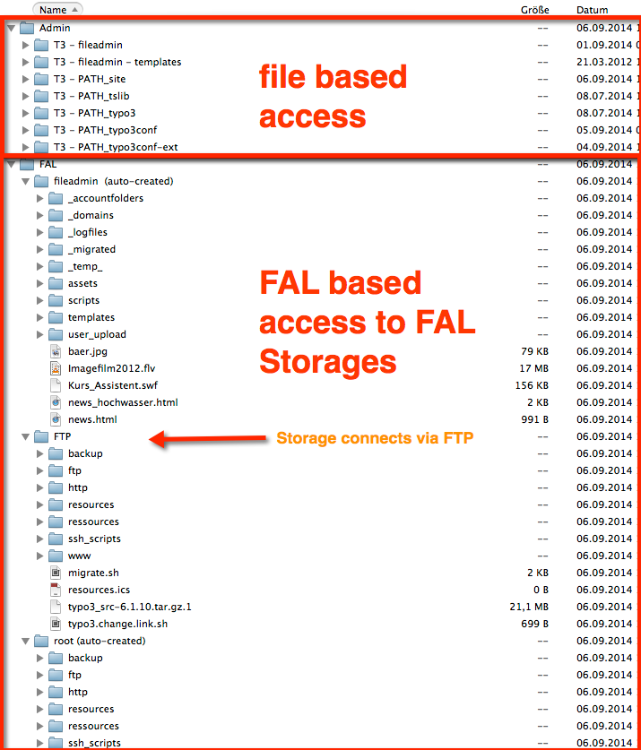

# Webdav access to TYPO3 CMS 6.1+ including FAL


This extension allow you to access the TYPO3 FS via Webdav.
Other virtual filesystems can also be added.



# Goal

This extension offers you the possibility to access your TYPO3 Installation via WebDav.

The WebDav URL is **http://<domain>/index.php/dav**

After opening the URI you're asked to input your user credentials. Just input your TYPO3 CMS user credentials. The extension webdav supports saltedpasswords so it should work in all environments.

# Configuration Options

All Configuration is done globally in the extensionmanager. There currently three Options:
* add cyberduck bookmarkfile in filelistmodule
* add webdav shortcur in filelist
* dav only hostname: 
while this option enables the server to completely capture the entered hostname for dav usage, it won't be possible to render other output via this hostname, this option requires .htaccess to redirect every call to index.php like it's needed for simulate static or realurl.

# Non windows users

On linux, bsd and OSX you can use the native connect to server method to connect to your TYPO3.

## OSX Settings

Also OSX has some scary settings, by default it tries to get a preview icon for all files in the filelist, as this is quite slow, you can dramatically speed it up with the following setting:

```bash
# Do not write hidden hidden meta files on drive
# http://support.apple.com/kb/HT1629
defaults write com.apple.desktopservices DSDontWriteNetworkStores true
```

# Windows users

It's really possible to use webdav on Windows nativly, from my point if view I do not recommend it!

## Using one of the Windows clients

There are several better and faster clients:

* Cyberduck (free)
 * http://code.google.com/p/sabredav/wiki/Cyberduck
* Totalcommander mit Webdav-Plugin (commercial)
 * http://ghisler.com/download.htm
 * http://ghisler.com/plugins.htm#filesys  
* netdrive (commercial)
 * http://www.netdrive.net/

## Adjusting your system settings for native Windows webdav client

If you still want to use the native Windows webdav client, you may need to adjust some settings in your registry.
As this may damage your system I do not provide any help an how to do this.

### Problems with Basic Auth?

If you have errors connecting via Basic Auth you may fix it via:

* http://support.microsoft.com/kb/841215

```
HKEY_LOCAL_MACHINE\SYSTEM\CurrentControlSet\Services\WebClient\Parameters\BasicAuthLevel = 2
```

### Errors copying files?

If copying files fails, try this option in your system registry

```
HKEY_LOCAL_MACHINE\SYSTEM\CurrentControlSet\Services\WebClient\Parameters\SupportLocking = 0
```

### Speed improvements

If native webdav is slow in comparision to the clients mentioned above i strongly recommend reading http://support.microsoft.com/kb/2445570 . This article describes how to disable Internet Explorers automatic proxy detection, which causes the delays.

You know, what to do afterwards? - Reboot ... and connect!

### Connect network share

To connect a webdav endpoint as netdrive there are 2 options either use the commandline or the graphical user interface. I recommend to use the command line.

```cmd
Connect with a share:
net use <CHAR>: https://<HOST>/index.php/dav /user:<BE_USER> [PASSWORD]
net use B: https://your.host.tld/index.php/dav /user:beuser bepassword
```
